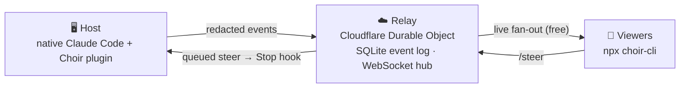

<div align="center">

# 🎶 Choir

### Multiplayer for Claude Code

**Watch, redirect, and hand off one live agent session as a team — right from your terminal.**

Your AI coding agent is the most powerful tool on your team. Choir makes it the first one you actually use *together*.

<br/>

[](https://www.npmjs.com/package/choir-cli)
[](LICENSE)
[](https://nodejs.org)
[](https://docs.claude.com/en/docs/claude-code)
[](#-configuration)
[](#-contributing)

</div>

---

## What is Choir?

Working with an AI agent is stuck in single-player. You open a session, type a prompt, and get an answer in a box only *you* can see. When you want a teammate involved, the best you can do is paste a read-only transcript they can't touch.

**Choir changes that.** It turns a live Claude Code session into something your whole team can join — like a shared document, but for the agent itself. A teammate opens one command in their terminal and can:

- 👀 **Watch** the agent work in real time — every prompt, tool call, result, and reply.
- 🎯 **Redirect** it mid-task — drop in a steering message and the agent acts on it.
- 🤝 **Hand off** the driver's seat — take over the exact same session on your own machine, with full context.

The person driving keeps using Claude Code exactly as they do today. Choir just makes the session a shared, living thing instead of a thousand private threads — and it costs **$0** to run.

```text
  Alice runs Claude Code            Bob, in his terminal
  ───────────────────────           ─────────────────────
  /choir:share write         ─────▶ npx choir-cli join choir1_aH…
                                     ● joined  👥 alice ✍, bob
  ▶ Bash  npm test                   ▶ Bash  npm test          (live)
    ✔ 42 passing                       ✔ 42 passing            (live)
                             ◀─────   "also add a test for the null case"
  ▶ Write test/null.test.ts          ↪ bob steered: also add a test…
    ✔ done                            ▶ Write test/null.test.ts (live)
```

---

## Table of Contents

- [Features](#-features)
- [How it works](#-how-it-works)
- [Getting started](#-getting-started)
- [Command reference](#-command-reference)
- [Permission scopes](#-permission-scopes)
- [Configuration](#-configuration)
- [Security](#-security)
- [Compatibility & roadmap](#-compatibility--roadmap)
- [Contributing](#-contributing)
- [Contributors](#-contributors)
- [License](#-license)

---

## ✨ Features

- 👀 **Live watch** — teammates replay everything so far, then tail the session live: prompts, tool calls, results, and the agent's replies.
- 🎯 **Real-time redirect** — steer a running agent. Your message is injected as the agent's next instruction and it adapts.
- 🤝 **Clean handoff** — pass control to a teammate cross-machine; they continue the same session with a rebuilt context bundle.
- 🎚️ **Permission scopes** — invite teammates as `view` (watch), `suggest` (propose, you approve), or `write` (steer directly).
- 🛑 **Host stays in control** — pause the agent, change a teammate's scope, or remove them at any time.
- 🔐 **Secrets stay on your machine** — outgoing events are redacted **before** they ever leave the host; the relay never sees your Claude API key.
- 🧩 **Non-intrusive** — you keep using native Claude Code. Choir is a plugin that adds hooks and `/choir:*` commands; nothing streams until you explicitly share.
- 💸 **Free to run** — the relay is a single Cloudflare Worker on the free tier, where fan-out to viewers is free. Self-hosted in one command.
- 🪶 **Zero-dependency host** — the plugin's hook scripts are plain Node with no install step.

---

## 🏗 How it works

Choir has three pieces: the **plugin** (on the host's machine), a tiny **relay** (self-hosted on Cloudflare), and the **`choir-cli` CLI** (for teammates).



- **The plugin** streams the session out through Claude Code hooks (redacting secrets on-host first) and injects teammates' steers back in at each turn boundary.
- **The relay** is the authoritative hub: one lightweight Durable Object per session holds an append-only event log (so late-joiners replay history, then tail live) and fans out over WebSockets. Outbound fan-out is free on Cloudflare, so adding viewers costs nothing.
- **The CLI** joins by code, renders the stream in your terminal, and sends steers back.

Everyone uses their **own** Claude auth. For the full design, see [`docs/architecture.md`](docs/architecture.md).

---

## 🚀 Getting started

### Prerequisites

| You need | For |
|----------|-----|
| [Claude Code](https://docs.claude.com/en/docs/claude-code) | Hosting and (optionally) driving sessions |
| [Node.js](https://nodejs.org) 18+ | The plugin's hook scripts and `npx choir-cli` |
| A free [Cloudflare](https://dash.cloudflare.com/sign-up) account | Hosting your team's relay (one-time) |

### 1. Deploy your relay (once per team)

The relay is a single Cloudflare Worker + Durable Object. It runs on the free plan and there's nothing to babysit.

```bash
git clone https://github.com/huzaifakhan04/multiplayer-ai-yc-rfs-f26 choir
cd choir/relay

npx wrangler login          # opens a browser to authorize Cloudflare
npx wrangler deploy         # deploys and prints your relay URL

# set the two secrets (any long random string for the signing key;
# any shared password your team will use for TEAM_KEY)
echo "$(openssl rand -hex 32)" | npx wrangler secret put TOKEN_SIGNING_KEY
echo "your-team-password"      | npx wrangler secret put TEAM_KEY
```

`wrangler deploy` prints your relay URL, e.g. `https://choir-relay.<your-subdomain>.workers.dev`. Share that URL and the `TEAM_KEY` with your team over a trusted channel.

> **First-time Cloudflare account?** If the deploy asks for a `workers.dev` subdomain, open **dash.cloudflare.com → Compute (Workers) → Workers & Pages** once to create one, then re-run `wrangler deploy`.

### 2. Install the plugin (each host)

In Claude Code:

```text
/plugin marketplace add huzaifakhan04/multiplayer-ai-yc-rfs-f26
/plugin install choir@choir
```

### 3. Configure (each host)

Point the plugin at your relay:

```bash
export CHOIR_RELAY_URL="https://choir-relay.<your-subdomain>.workers.dev"
export CHOIR_TEAM_KEY="your-team-password"
export CHOIR_NAME="Alice"
```

(Add these to your shell profile, or run `npx choir-cli config --relay <url> --team-key <key> --name Alice`.)

### 4. Share a session and invite teammates

```text
/choir:share write
```

It prints a self-contained join code:

```text
🎶 Choir is live for this session. Teammates can join with one command — no setup:

    npx choir-cli join choir1_aHR0cHM6Ly9jaG9pci1yZWxheS4uLg
```

Drop that line in your team chat. Teammates run it — the relay is baked into the code, so they need nothing configured:

```bash
npx choir-cli join choir1_aHR0cHM6Ly9jaG9pci1yZWxheS4uLg
```

They replay the session so far, then watch it live. With a `suggest` or `write` code, they can type a line and press **Enter** to steer.

---

## 📖 Command reference

### Host commands (inside Claude Code)

| Command | What it does |
|---------|--------------|
| `/choir:share [view\|suggest\|write]` | Start sharing the current session and print a join code. The scope sets what teammates can do (defaults to `view`). **Nothing is streamed until you run this** — before that, the hooks stay silent. |
| `/choir:roster` | List everyone currently connected to the session, with their role and scope. |
| `/choir:pause` | Freeze the agent — its tool calls are blocked until you resume. Useful to stop and discuss. |
| `/choir:resume` | Unfreeze a paused session so the agent can act again. |
| `/choir:scope <name> <view\|suggest\|write>` | Change a teammate's permission on the fly (e.g. promote a watcher to `write`). |
| `/choir:approve` | Approve pending steers proposed by `suggest`-scope teammates so they get injected. |
| `/choir:kick <name>` | Remove a teammate from the session and revoke their access immediately. |
| `/choir:handoff <name>` | Hand the driver's seat to a teammate. You become a viewer; they continue on their machine with the shared context. |
| `/choir:take-handoff` | Pick up a session that was handed off to you (run after `npx choir-cli take`). Loads the context bundle and makes your session the new driver. |

### Viewer commands (terminal, via `npx choir-cli`)

| Command | What it does |
|---------|--------------|
| `npx choir-cli join <code>` | Join a shared session by its code. Replays the history, then tails it live. With `suggest`/`write` scope you can steer. |
| `npx choir-cli take <code> --name <you>` | Accept a handoff directed at you, then run `/choir:take-handoff` in Claude Code to continue as the driver. |
| `npx choir-cli config --relay <url> [--team-key <key>] [--name <you>]` | Save your relay URL and identity to `~/.config/choir/config.json`. |
| `npx choir-cli help` | Show usage. |

> **Tip:** run `npm i -g choir-cli` once and you can type `choir join <code>` instead of `npx choir-cli join <code>`.

**In-session keys (with `suggest`/`write` scope):** type a line + **Enter** to steer · `/who` to see who's connected · `/quit` to leave.

---

## 🎚 Permission scopes

Every teammate joins with a scope, chosen by the host at share time (and changeable with `/choir:scope`):

| Scope | Watch | Steer | Behavior |
|-------|:-----:|:-----:|----------|
| `view` | ✅ | ❌ | Read-only. Watch the session, no input. |
| `suggest` | ✅ | ⏳ | Propose steers; the host approves them with `/choir:approve` before they're injected. |
| `write` | ✅ | ✅ | Steers are injected directly at the next turn boundary. |

Steering is always injected as *guidance* — the host's own Claude Code permission prompts still gate every real action, so a remote steer can never bypass the host's local approvals.

---

## 🔧 Configuration

### Environment variables

| Variable | Used by | Description |
|----------|---------|-------------|
| `CHOIR_RELAY_URL` | host + viewer | Base URL of your relay (e.g. `https://choir-relay.you.workers.dev`). |
| `CHOIR_TEAM_KEY` | host | Shared password that authorizes opening a session on the relay. |
| `CHOIR_NAME` | host + viewer | Your display name in the roster. |
| `CHOIR_DATA_DIR` | host | Where per-session state is cached. Defaults to `~/.choir`. |

Anything set in the environment overrides the config file at **`~/.config/choir/config.json`** (written by `npx choir-cli config`).

### Relay secrets (set on Cloudflare)

| Secret | Description |
|--------|-------------|
| `TEAM_KEY` | The shared password your team uses to open sessions. |
| `TOKEN_SIGNING_KEY` | A long random string used to sign session tokens. |

Set or rotate them anytime with `npx wrangler secret put <NAME>` from the `relay/` directory.

---

## 🔐 Security

Choir is designed for **one trusted team** — people who'd pair-program with each other. Highlights:

- **Secrets are redacted on the host, before egress.** The filter runs inside the hook on your machine — sensitive paths (`.env`, `.ssh`, `.aws`, keys, credentials) and secret-shaped strings (API keys, tokens, private keys) are stripped before anything reaches the relay.
- **A remote steer can't bypass your local permission gate.** Steers are injected as instructions the agent reads, not as tool calls. Your own Claude Code permission prompts still gate every real command.
- **Your Claude API key never leaves your machine.** The relay only ever sees redacted session events; everyone uses their own Claude auth.
- **You hold the kill switch.** Pause, kick, re-scope, or end the session at any time. Access is gated by a shared `TEAM_KEY` plus short-lived, revocable per-session tokens.

Read the full model — including what Choir does *not* protect against — in [`docs/security.md`](docs/security.md).

---

## 🧭 Compatibility & roadmap

> **Today, Choir works with [Claude Code](https://docs.claude.com/en/docs/claude-code) only.** The host-side integration is built on Claude Code's plugin and hooks system, which is specific to Claude Code.

The good news: the **relay** and the **`choir-cli` client are agent-agnostic** — they speak a simple, documented event protocol. Bringing Choir to another tool means writing a thin *host adapter* for it; the shared session, relay, and viewer stay exactly the same.

**Planned:**

- [ ] **OpenAI Codex** host adapter
- [ ] **Cursor** host adapter
- [ ] More agents — Windsurf, Aider, Gemini CLI, and others
- [ ] **Web viewer** — watch and steer from a browser, no terminal required
- [ ] Session recording & searchable history
- [ ] Idle-session wake (steer an agent even when it's sitting idle)

Want Choir on your tool of choice? [Open an issue](https://github.com/huzaifakhan04/multiplayer-ai-yc-rfs-f26/issues) or contribute an adapter — see below.

---

## 🤝 Contributing

Contributions are welcome and appreciated — bug reports, docs, tests, and especially new host adapters.

**Project layout**

| Path | What |
|------|------|
| `plugin/` | The Claude Code plugin — hooks, `/choir:*` commands, on-host redaction (zero-dependency Node) |
| `relay/` | The Cloudflare Worker + Durable Object (WebSocket hub + SQLite event log + tokens) |
| `cli/` | `choir-cli` — the terminal viewer/steerer published to npm |
| `packages/protocol/` | Shared wire types spoken by every surface |
| `docs/` | Architecture, security, and quickstart docs |

**Develop locally**

```bash
git clone https://github.com/huzaifakhan04/multiplayer-ai-yc-rfs-f26
cd multiplayer-ai-yc-rfs-f26
pnpm install

pnpm test                                        # run the unit suite
pnpm --filter @choir/relay exec wrangler dev      # run the relay locally on :8787
claude --plugin-dir ./plugin                      # try the plugin without installing it
```

**Workflow:** fork → branch → make your change (with tests) → open a pull request. Please keep the host scripts dependency-free and run `pnpm test` before submitting. See [`docs/architecture.md`](docs/architecture.md) to get oriented.

---

## 👥 Contributors

Thanks to everyone who helps make Choir better. This list updates automatically as people contribute.

<a href="https://github.com/huzaifakhan04/multiplayer-ai-yc-rfs-f26/graphs/contributors">
  
</a>

*Made something better? Send a PR and your avatar shows up here.*

---

## 📜 License

**Choir is free and open source, released under the [MIT License](LICENSE) — and it will stay that way.**

You are free to **use, copy, modify, and distribute** Choir for any purpose, personal or commercial, at no cost. This repository is public and will remain public. The MIT License was chosen deliberately: it's the most permissive, lowest-friction license available, so Choir stays free for everyone, forever, with no strings attached and no lock-in.

> **In short:** Choir belongs to the community. Fork it, ship it, build on it — no fees, no gatekeeping, no catch.

Copyright © 2026 [huzaifakhan04](https://github.com/huzaifakhan04) and contributors.

<div align="center">
<br/>

**If Choir is useful to you, consider [starring the repo](https://github.com/huzaifakhan04/multiplayer-ai-yc-rfs-f26) ⭐**

*Built for teams who'd rather not work alone.*

</div>
